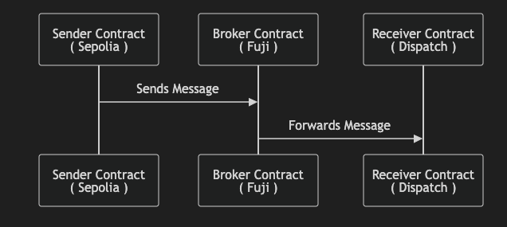

> _This repository represents an example of using a Chainlink product or service. It is provided to help you understand how to interact with Chainlink’s systems so that you can integrate them into your own. This template is provided "AS IS" without warranties of any kind, has not been audited, and may be missing key checks or error handling to make the usage of the product more clear. Take everything in this repository as an example and not something to be copy pasted into a production ready service._

# ccip-avalanche
[](https://gitpod.io/#https://github.com/smartcontractkit/ccip-icm)

Demonstrating how to use Chainlink Cross-Chain Interoperobility Protocol (CCIP) and Avalanche Interchain Messaging (ICM) to send a message from Ethereum Sepolia to Avalanche Fuji (_via CCIP_), then forwarding that message from Avalanche Fuji to Dispatch L1 (_via ICM_).

# Getting Started

In the next section you can see how to send data from one chain to another. But before that, you need to set up some environment variables, install dependencies, setup environment variables, and compile contracts.

## 1. Install Dependencies

```bash {"vsls_cell_id":"cd2b2274-6032-4d78-b663-f24e2ec684f1"}
yarn && make
```

## 2. Setup Environment Variables

Run the command below, then update the .env `PRIVATE_KEY` and `ETHERSCAN-API-KEY` variables.

```bash {"vsls_cell_id":"294c87a7-e413-4580-9d15-e062a1d33301"}
cp .env.example .env && source .env
```

## 3. Create Wallet

To create a new wallet that is stored in a keystore, issue the following command, which will prompt you to secure the private key with a password.

```bash {"vsls_cell_id":"9e50f506-0471-40a9-8402-01334d462096"}
cast wallet import --private-key $PRIVATE_KEY -k keystore $ACCOUNT_NAME 
```

For ease use of the keystore we already configured a environment variable called `KEYSTORE` pointing to the `keystore` file in the working directory.

You can use the wallet stored in the keystore by adding the `--keystore` flag instead of the `--private-key` flag.

```bash {"vsls_cell_id":"322c9173-27be-4d3e-b47c-9549367b4047"}
cast wallet address --keystore $KEYSTORE
```

## 4. Prepare Smart Contracts

### Smart Contract Design



### A. Deploy Contracts

In order to interact with our contracts, we first need to deploy them, which is simplified in the [`script/Deploy.s.sol`](./script/Deploy.s.sol) smart contract.

We have package scripts that enable you to deploy contracts, as follows:

```sh {"vsls_cell_id":"43b7fbea-91eb-4d70-a863-dc11f0264416"}
yarn deploy:sender
```

> [`MessageSender.sol`](./src/MessageSender.sol)

```sh {"vsls_cell_id":"7ff89f1f-12d9-47bb-bc18-a37c8c55dac8"}
yarn deploy:broker
```

> [`MessageBroker.sol`](./src/MessageBroker.sol)

```sh {"vsls_cell_id":"83eabce3-edae-498c-8644-906ce400e2dc"}
yarn deploy:receiver
```

> [`MessageReceiver.sol`](./src/MessageReceiver.sol)

### B. Fund Sender Contract

After acquiring testnet tokens, you will proceed with funding your [Message Sender Contract](./src/MessageSender.sol) with some native tokens (ETH).

```sh {"vsls_cell_id":"94c2c6a1-d76d-4b60-83bf-b837d6ee3903"}
cast send $MESSAGE_SENDER_ADDRESS --rpc-url ethereumSepolia --value 0.05ether --keystore keystore
```

# Messaging Cross-Chain

> *Before proceeding, please ensure you have completed the steps outlined in the [Setup Messaging Scenario](#setup-messaging-scenario) section above.*

## 1. Ethereum Sepolia &rarr; Avalanche Fuji

### Sending Message (Sepolia &rarr; Fuji)

Run the following to send a message to Fuji from Sepolia via the `SendMessage` functionality coded in [Send.s.sol](./script/Send.s.sol):

```bash {"vsls_cell_id":"001a3bf3-2a75-4bd5-bd9a-46e602e080c3"}
forge script ./script/Send.s.sol:SendMessage -vvv --broadcast --rpc-url ethereumSepolia --sig \"run(string)\" -- "$CUSTOM_MESSAGE"
```

## 2. Avalanche Fuji &rarr; Dispatch Testnet

### Brokering Message (Fuji &rarr; Dispatch)

Once the message is finalized on the broker chain (*Fuji*), you may see the details about the latest message via the `BrokerMessage` functionality coded in [Broker.s.sol](./script/Broker.s.sol). After you have confirmed the latest message you received looks good, you may proceed with running the following script to broker the message to Dispatch:

```bash {"vsls_cell_id":"68e3c9cb-d636-495f-a817-a07ebbbadb93"}
cast send $MESSAGE_BROKER_ADDRESS --rpc-url avalancheFuji --keystore keystore "brokerMessage(address)" $MESSAGE_RECEIVER_ADDRESS
```

## 3. Dispatch Testnet

### Receiving Message (Dispatch)

After running the script above to broker the message from Fuji to Dispatch, you may confirm the message was received by running the following script:

```bash {"vsls_cell_id":"dc6d52d2-1468-48a0-8634-526abe534f0c"}
forge script ./script/Receive.s.sol:ReceiveMessage -vvv --broadcast --rpc-url dispatchTestnet
```